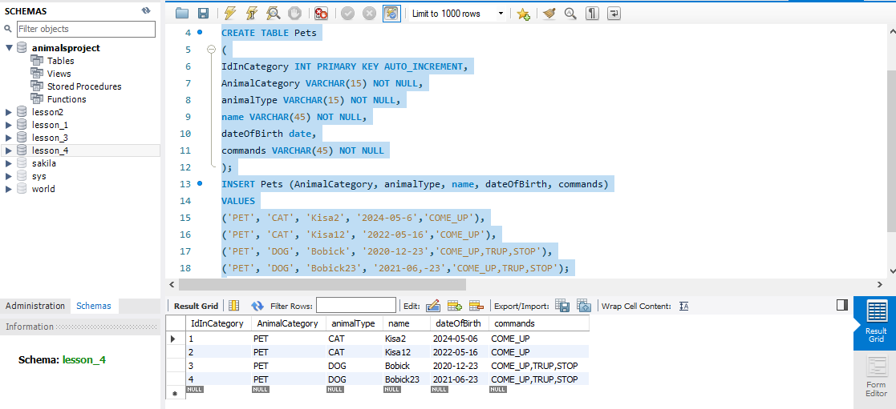
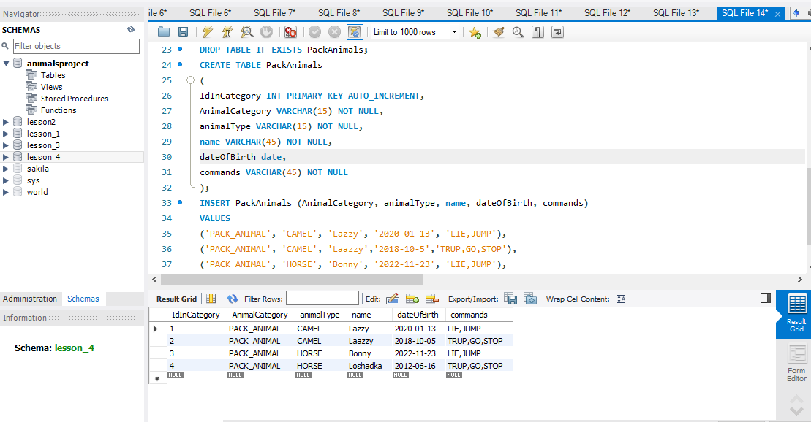
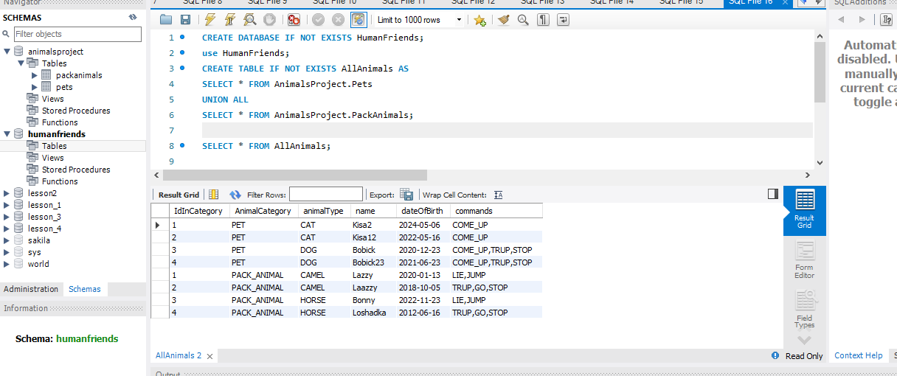
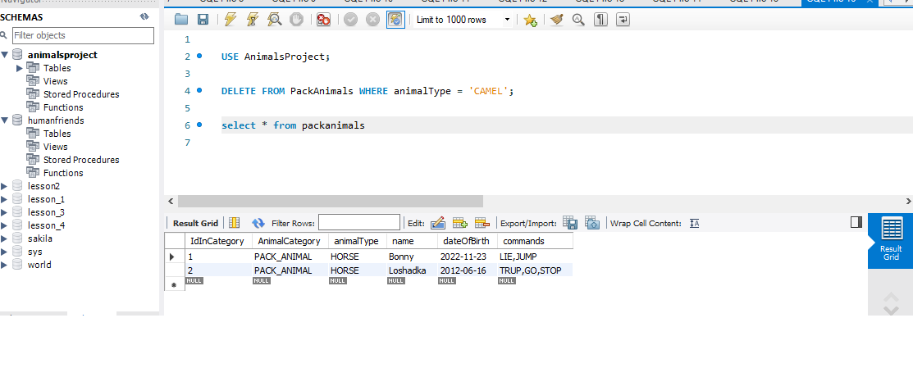
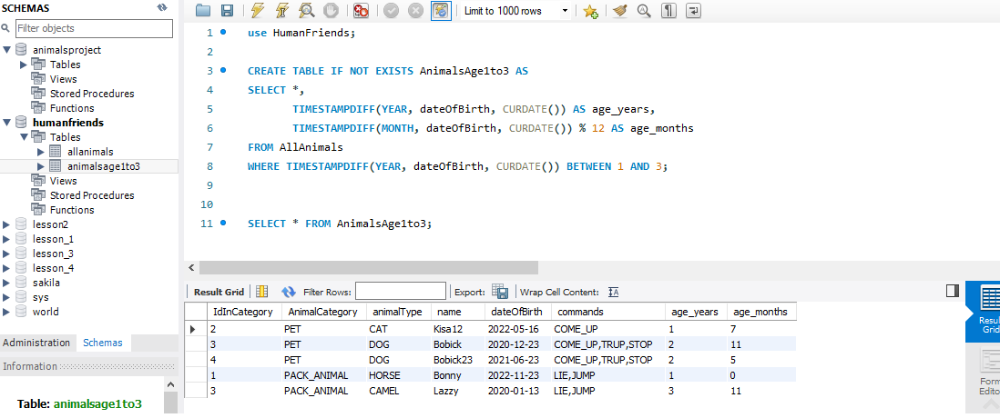

# Итоговая контрольная работа
____________________
## Система учета для питомника домашних и вьючных животных
____________________
### Операционные системы и виртуализация линукс
1.cat > Pets.txt(создали файл домашних животных)

собаки
кошки
хомяки(наполнили его)

cat > PackAnimals.txt (создали файл вьючных животных)

лошади
верблюды
ослы (наполнили его)

cat Pets.txt PackAnimals.txt > HumanFriends.txt (объединили 2 файла в 1)

cat HumanFriends.txt (посмотрели содержимое файла)

mv HumanFriends.txt "Human Friends.txt" (переименовали)

ls(посмотрели содержимое каталога)

_______________
2.mkdir MyFriendsDirectory(создали новую директорию)

mv "Human Friends.txt" MyFriendsDirectory/(переместили туда наш файл)
_______________
3.sudo apt update (обновили индексы пакетов)

sudo apt install mysql-server (установили пакет репозитория)
_______________
4.sudo dpkg -i example.deb (установили)

sudo dpkg -r example (удалили)
______________________
5.на данный момент Linux у меня удален,но примерно комманды такие,как могу)

### Объектно-ориентированное программирование
6.Диаграмма классов доступна по ссылке [Диаграмма](https://drive.google.com/file/d/1yK6uslQJCNQm9WWH3IvOcASI0CBxNBP0/view?usp=sharing)
_______________
7.Создали и заполнили таблицу Pets
________________
CREATE DATABASE IF NOT EXISTS AnimalsProject;

use AnimalsProject;

DROP TABLE IF EXISTS Pets;

CREATE TABLE Pets

(

IdInCategory INT PRIMARY KEY AUTO_INCREMENT,

AnimalCategory VARCHAR(15) NOT NULL,

animalType VARCHAR(15) NOT NULL,

name VARCHAR(45) NOT NULL,

dateOfBirth date,

commands VARCHAR(45) NOT NULL

);

INSERT Pets (AnimalCategory, animalType, name, dateOfBirth, commands)

VALUES

('PET', 'CAT', 'Kisa2', '2024-05-6','COME_UP'),

('PET', 'CAT', 'Kisa12', '2022-05-16','COME_UP'),

('PET', 'DOG', 'Bobick', '2020-12-23','COME_UP,TRUP,STOP'),

('PET', 'DOG', 'Bobick23', '2021-06,-23','COME_UP,TRUP,STOP');

select * from pets

_____________
Создали и заполнили таблицу PackAnimals

use AnimalsProject;

DROP TABLE IF EXISTS PackAnimals;

CREATE TABLE PackAnimals

(

IdInCategory INT PRIMARY KEY AUTO_INCREMENT,

AnimalCategory VARCHAR(15) NOT NULL,

animalType VARCHAR(15) NOT NULL,

name VARCHAR(45) NOT NULL,

dateOfBirth date,

commands VARCHAR(45) NOT NULL

);

INSERT PackAnimals (AnimalCategory, animalType, name, dateOfBirth, commands)

VALUES

('PACK_ANIMAL', 'CAMEL', 'Lazzy', '2020-01-13', 'LIE,JUMP'),

('PACK_ANIMAL', 'CAMEL', 'Laazzy','2018-10-5','TRUP,GO,STOP'),

('PACK_ANIMAL', 'HORSE', 'Bonny', '2022-11-23', 'LIE,JUMP'),

('PACK_ANIMAL', 'HORSE', 'Loshadka','2012-06-16','TRUP,GO,STOP');

select * from PackAnimals

____________________
создаем в новой бд новую таблицу,в которой объединяем 2 превых

CREATE DATABASE IF NOT EXISTS HumanFriends;

use HumanFriends;

CREATE TABLE IF NOT EXISTS AllAnimals AS

SELECT * FROM AnimalsProject.Pets

UNION ALL

SELECT * FROM AnimalsProject.PackAnimals;

SELECT * FROM AllAnimals;

_________________
удаляем записи о верблюдах

USE AnimalsProject;

DELETE FROM PackAnimals WHERE animalType = 'CAMEL';

select * from packanimals

_________________
новая таблица с возрастом 1-3года

use HumanFriends;

CREATE TABLE IF NOT EXISTS AnimalsAge1to3 AS

SELECT *,

TIMESTAMPDIFF(YEAR, dateOfBirth, CURDATE()) AS age_years,

TIMESTAMPDIFF(MONTH, dateOfBirth, CURDATE()) % 12 AS age_months

FROM AllAnimals

WHERE TIMESTAMPDIFF(YEAR, dateOfBirth, CURDATE()) BETWEEN 1 AND 3;

SELECT * FROM AnimalsAge1to3;

_______________
8.ООП и Java. Весь пункт реализован,в документации к методам проставлены конкретные пункты